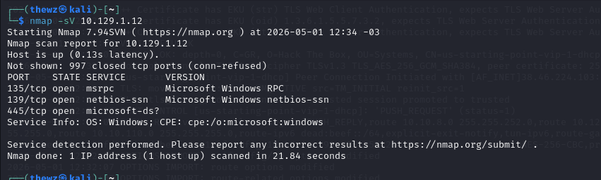

# Dancing

> **Difficulty:** Easy | **OS:** Linux | **Release:** Retired

---

## General Information

| Field | Value |
|:------|:------|
| **Name** | Dancing |
| **IP** | 10.129.1.12 |
| **OS** | Linux |
| **Difficulty** | Easy |
| **Date** | 01/05/2025 |
| **Release** | Retired |

---

## Initial Enumeration

### Open Ports

| Port | Service | Version |
|:------|:--------|:-------|
| 135 | msrpc | Microsoft RPC |
| 139 | netbios-ssn | NetBIOS SSN |
| 445 | microsoft-ds | SMB |

### Commands

```bash
nmap -sV -p- -T4 10.129.1.12
nmap -sVC -p- 10.129.1.12
```

---

## Exploitation

### Entry Vector

| Field | Value |
|:------|:------|
| **Vector** | SMB |
| **Flaw** | Anonymous access to SMB share |
| **Tools** | smbclient |

### Step 1 - Initial enumeration

Enumerated port 445, which usually runs the SMB protocol. I'll try listing the shared directories via SMB.



### Step 2 - Listing shares

I found a few directories; I'll try accessing the WorkShares drive.


### Step 3 - Accessing Workshares

I managed to connect to the workshares drive; let's look for something.


### Step 4 - Finding files

I found a file called worknotes.txt and another called flag.txt, downloaded both, and obtained the flags.


---

## Technical Summary

| Field | Value |
|:------|:------|
| **Root Cause** | Anonymous access to SMB share |
| **Attack Chain** | SMB Enumeration → Anonymous access → File reading |
| **Total Time** | ~15 minutes |

---

## Lessons Learned

- **What worked:** Access via smbclient with no password
- **What slowed things down:** Identifying the correct service
- **Points of Attention:** Always check unusual services

---

## References

- [HTB Dancing](https://app.hackthebox.com/machines/Dancing)
