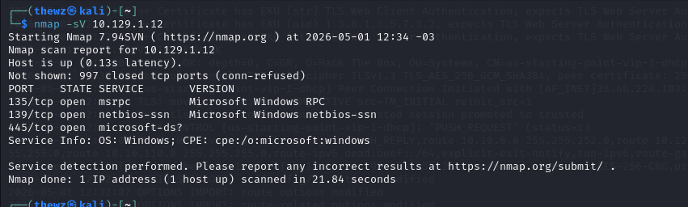

# Dancing

> **Dificuldade:** Easy | **SO:** Linux | **Release:** Retired

---

## Informações Gerais

| Campo | Valor |
|:------|:------|
| **Nome** | Dancing |
| **IP** | 10.129.1.12 |
| **SO** | Linux |
| **Dificuldade** | Easy |
| **Data** | 01/05/2025 |
| **Release** | Retired |

---

## Enumeração Inicial

### Portas Abertas

| Porta | Serviço | Versão |
|:------|:--------|:-------|
| 135 | msrpc | Microsoft RPC |
| 139 | netbios-ssn | NetBIOS SSN |
| 445 | microsoft-ds | SMB |

### Comandos

```bash
nmap -sV -p- -T4 10.129.1.12
nmap -sVC -p- 10.129.1.12
```

---

## Exploração

### Vetor de Entrada

| Campo | Valor |
|:------|:------|
| **Vetor** | SMB |
| **Falha** | Acesso anônimo a compartilhamento SMB |
| **Ferramentas** | smbclient |

### Passo 1 - Enumeração inicial

Enumerada porta 445, que geralmente se utiliza o protocolo SMB. Vou tentar listar os diretórios compartilhados via SMB.



### Passo 2 - Listando compartilhamentos

Descobri alguns diretórios, vou tentar acessar o disco WorkShares.


### Passo 3 - Acessando Workshares

Consegui me conectar ao disco workshares, vou procurar por algo.


### Passo 4 - Encontrando arquivos

Encontrei um arquivo chamado worknotes.txt e outro chamado flag.txt, fiz o download dos dois, onde obtive as flags.


---

## Resumo Técnico

| Campo | Valor |
|:------|:------|
| **Causa Raiz** | Acesso anônimo a compartilhamento SMB |
| **Cadeia de Ataque** | Enumeração SMB → Acesso anônimo → Leitura de arquivos |
| **Tempo Total** | ~15 minutos |

---

## Lições Aprendidas

- **O que funcionou:** Acesso via smbclient sem senha
- **O que atrasou:** Identificar o serviço correto
- **Pontos de Atenção:** Sempre verificar serviços incomuns

---

## Referências

- [HTB Dancing](https://app.hackthebox.com/machines/Dancing)