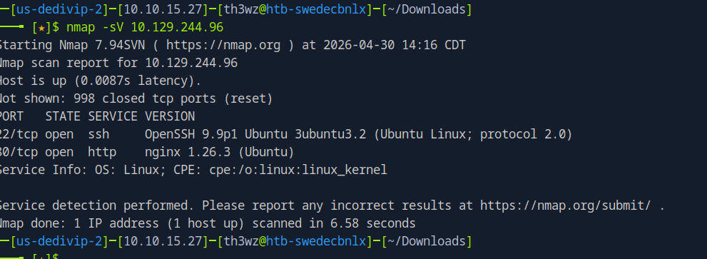

# Facts

> **Difficulty:** Easy | **OS:** Linux | **Release:** Active

---

## General Information

| Field | Value |
|:------|:------|
| **Name** | Facts |
| **IP** | 10.129.244.96 |
| **OS** | Linux |
| **Difficulty** | Easy |
| **Date** | 30/04/2025 |
| **Release** | Active |
| **Status** | In Progress |

---

## Initial Enumeration

### Open Ports

| Port | Service | Version |
|:------|:--------|:-------|
| 22 | ssh | OpenSSH 9.9p1 |
| 80 | http | Nginx 1.26.3 (Ubuntu) |

### Commands

```bash
nmap -sV -p- -T4 10.129.244.96
```

---

## Exploitation

### Entry Vector

| Field | Value |
|:------|:------|
| **Vector** | Web |
| **Flaw** | Web directory enumeration |
| **Tools** | Browser, source code |

### Step 1 - Initial scan

I ran a simple Nmap:



### Step 2 - Source code analysis

Accessing the link found in the main page's HTML, I got access to the following information:

HostId: dd9025bab4ad464b049177c95eb6ebf374d3b3fd1af9251148b658df7ac2e3e8


### Step 3 - Endpoint discovery

http://facts.htb/randomfacts/ I found this URL by looking at the page's source code.


---

## Technical Summary

| Field | Value |
|:------|:------|
| **Root Cause** | Under investigation |
| **Attack Chain** | Web enumeration → Endpoint discovery → Exploitation in progress |
| **Total Time** | In progress |

---

## Lessons Learned

- **What worked well:** Source code analysis to discover endpoints
- **What slowed things down:** Exploitation still in progress
- **Commands to review later:** Web enumeration techniques

---

## References

- [HTB Facts](https://app.hackthebox.com/machines/Facts)
