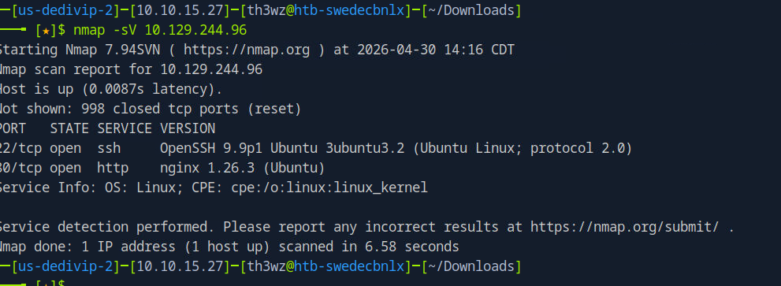

# Facts

> **Dificuldade:** Easy | **SO:** Linux | **Release:** Active

---

## Informações Gerais

| Campo | Valor |
|:------|:------|
| **Nome** | Facts |
| **IP** | 10.129.244.96 |
| **SO** | Linux |
| **Dificuldade** | Easy |
| **Data** | 30/04/2025 |
| **Release** | Active |
| **Status** | Em Andamento |

---

## Enumeração Inicial

### Portas Abertas

| Porta | Serviço | Versão |
|:------|:--------|:-------|
| 22 | ssh | OpenSSH 9.9p1 |
| 80 | http | Nginx 1.26.3 (Ubuntu) |

### Comandos

```bash
nmap -sV -p- -T4 10.129.244.96
```

---

## Exploração

### Vetor de Entrada

| Campo | Valor |
|:------|:------|
| **Vetor** | Web |
| **Falha** | Enumeração de diretórios web |
| **Ferramentas** | Navegador, código fonte |

### Passo 1 - Scan inicial

Fiz um Nmap simples:



### Passo 2 - Análise do código fonte

Acessando o link encontrado no HTML da página principal, tive acesso às seguintes informações:

HostId: dd9025bab4ad464b049177c95eb6ebf374d3b3fd1af9251148b658df7ac2e3e8


### Passo 3 - Descoberta de endpoint

http://facts.htb/randomfacts/ encontrei essa URL vendo o código fonte da página.


---

## Resumo Técnico

| Campo | Valor |
|:------|:------|
| **Causa Raiz** | Em investigação |
| **Cadeia de Ataque** | Enumeração web → Descoberta de endpoint → Exploração em andamento |
| **Tempo Total** | Em progresso |

---

## Lições Aprendidas

- **O que funcionou bem:** Análise de código fonte para descobrir endpoints
- **O que atrasou:** Exploração em andamento
- **Comandos para revisar depois:** Técnicas de enumeração web

---

## Referências

- [HTB Facts](https://app.hackthebox.com/machines/Facts)