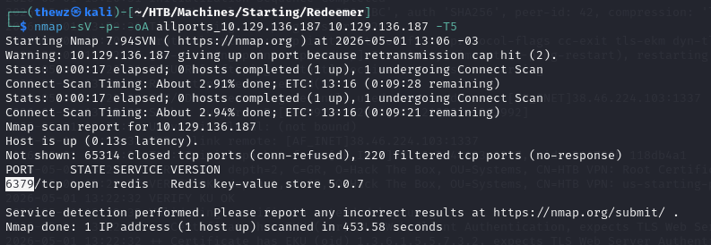

# Redeemer

> **Difficulty:** Easy | **OS:** Linux | **Release:** Active

---

## General Information

| Field | Value |
|:------|:------|
| **Name** | Redeemer |
| **IP** | 10.129.136.187 |
| **OS** | Linux |
| **Difficulty** | Easy |
| **Date** | 01/05/2025 |
| **Release** | Active |

---

## Initial Enumeration

### Open Ports

| Port | Service | Version |
|:------|:--------|:-------|
| 6379 | redis | Redis |

### Commands

```bash
nmap -sV -p- -oA allports_10.129.136.187 10.129.136.187 -T5
redis-cli -h 10.129.136.187 info
```

---

## Exploitation

### Entry Vector

| Field | Value |
|:------|:------|
| **Vector** | Redis |
| **Flaw** | Redis without authentication |
| **Tools** | redis-cli |

### Step 1 - Initial scan

The initial Nmap with the top 1000 ports returned nothing, so I ran:

```bash
nmap -sV -p- -oA allports_10.129.136.187 10.129.136.187 -T5
```

I'm scanning all ports with thread5 to find the open TCP port.



### Step 2 - Discovering Redis

I found port 6379, running Redis. After some research, I found out that `redis-cli -h <IP>` communicates with the host over the Redis protocol. I used the command:

```bash
redis-cli -h 10.129.136.187 info
```

Where I got the result and saved it to a file called redis-info.txt.

### Step 3 - Redis connection

After extracting the information, I tried connecting with redis-cli, just dropping the info command at the end. I was able to connect to the service and extract the information needed to finish the machine.


---

## Technical Summary

| Field | Value |
|:------|:------|
| **Root Cause** | Redis without authentication |
| **Attack Chain** | Port enumeration → Direct Redis connection → Get flags |
| **Total Time** | ~20 minutes |

---

## Lessons Learned

- **What worked:** Full scan of all ports
- **What slowed things down:** Default Nmap scan didn't detect the high port (6379)
- **Points of Attention:** Always scan all ports on HTB machines

---

## References

- [HTB Redeemer](https://app.hackthebox.com/machines/Redeemer)
