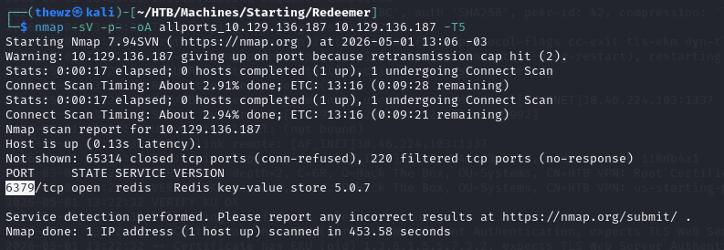

# Redeemer

> **Dificuldade:** Easy | **SO:** Linux | **Release:** Active

---

## Informações Gerais

| Campo | Valor |
|:------|:------|
| **Nome** | Redeemer |
| **IP** | 10.129.136.187 |
| **SO** | Linux |
| **Dificuldade** | Easy |
| **Data** | 01/05/2025 |
| **Release** | Active |

---

## Enumeração Inicial

### Portas Abertas

| Porta | Serviço | Versão |
|:------|:--------|:-------|
| 6379 | redis | Redis |

### Comandos

```bash
nmap -sV -p- -oA allports_10.129.136.187 10.129.136.187 -T5
redis-cli -h 10.129.136.187 info
```

---

## Exploração

### Vetor de Entrada

| Campo | Valor |
|:------|:------|
| **Vetor** | Redis |
| **Falha** | Redis sem autenticação |
| **Ferramentas** | redis-cli |

### Passo 1 - Scan inicial

O Nmap inicial com as top 1000 ports não retornou nada, então rodei:

```bash
nmap -sV -p- -oA allports_10.129.136.187 10.129.136.187 -T5
```

Estou escaneando todas as portas com thread5 para buscar a porta TCP aberta.



### Passo 2 - Descoberta do Redis

Encontrei a porta 6379, que está rodando Redis. Com algumas pesquisas, descobri que o `redis-cli -h <IP>` faz uma comunicação Redis com o host. Usei o comando:

```bash
redis-cli -h 10.129.136.187 info
```

Onde obtive o resultado que salvei num arquivo redis-info.txt.

### Passo 3 - Conexão Redis

Após extrair as informações, tentei me conectar com redis-cli, apenas retirando o comando info do final. Onde pude me conectar ao serviço e extrair as informações necessárias para finalizar a máquina.


---

## Resumo Técnico

| Campo | Valor |
|:------|:------|
| **Causa Raiz** | Redis sem autenticação |
| **Cadeia de Ataque** | Enumeração de portas → Conexão Redis direta → Get flags |
| **Tempo Total** | ~20 minutos |

---

## Lições Aprendidas

- **O que funcionou:** Scan completo de todas as portas
- **O que atrasou:** Nmap padrão não detectou porta alta (6379)
- **Pontos de Atenção:** Sempre escanear todas as portas em máquinas HTB

---

## Referências

- [HTB Redeemer](https://app.hackthebox.com/machines/Redeemer)