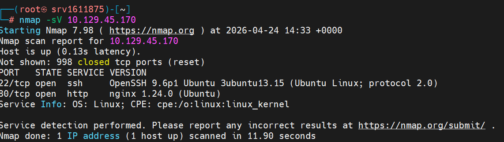

# Silentium

> **Difficulty:** Easy | **OS:** Linux | **Release:** Active

---

## General Information

| Field | Value |
|:------|:------|
| **Name** | Silentium |
| **IP** | 10.129.45.170 |
| **OS** | Linux |
| **Difficulty** | Easy |
| **Date** | 24/04/2025 |
| **Release** | Active |
| **Status** | In Progress |

---

## Initial Enumeration

### Open Ports

| Port | Service | Version |
|:------|:--------|:-------|
| 22 | ssh | OpenSSH |
| 80 | http | Nginx |

### Commands

```bash
nmap -sV -p- -T4 10.129.45.170
```

---

## Exploitation

### Entry Vector

| Field | Value |
|:------|:------|
| **Vector** | Web |
| **Flaw** | Password Reset Token Leak + Flowise RCE |
| **Tools** | Burp Suite, FFUF |

### Step 1 - Port and service enumeration

Enumerating the ports and services running on the target.



---

### Step 2 - Accessing silentium.htb

Accessing the target's HTTP, we identify a domain **silentium.htb**.

I found collaborator names on the page:
- Marcus Thorne (Managing Director)
- Ben (Head of Financial Systems)
- Elena Rossi (Chief Risk Officer)


---

### Step 3 - Subdomain discovery

Fuzzing with the discovered domain, the subdomain **staging.silentium.htb** was found.


---

### Step 4 - Login page

Accessing the subdomain via web, we can see it's a login page, but we don't have credentials.

The page is using **Flowise**.


---

### Step 5 - Password Reset

Since we have the collaborators' names on silentium.htb's home page, I tried using the email **ben@silentium.htb**, being the only one with a simple first name and no surname.

Surprisingly, I got a response with a temporary token to reset the password!


---

### Step 6 - Changing the admin password

After a few attempts at changing the password, I managed to do it with the temporary token (you have to be quick before it expires).

I managed to change the password to **Password@123**

Encryption key found: **hdsVqdkOcLN4fwdpvMPtbAi2++qi8yFc**


---

### Step 7 - Access to the admin panel

After having the credentials, I accessed the admin panel.


---

### Step 8 - Identifying Flowise

Accessing the admin panel, I identified it's using the **Flowise** tool.

With this information, I decided to search for CVEs related to the tool. I found two exploits.


---

### Step 9 - Researching exploits

Researching the exploits, I saw that **JS Injection** allows remote code execution, using a package called CustomMCP.ts.

If the FLOWISE_USERNAME and FLOWISE_PASSWORD environment variables aren't set, only the email and password for Flowise access are required.


---

### Step 10 - Running the RCE exploit

Using the exploit and setting the necessary parameters for the connection, we managed to open a reverse shell with the server.


---

### Step 11 - SSH access as Ben

With shell access, after several attempts manually searching through the folders, I ran a cat looking for environment variables.

I decided to use the SMTP credential for SSH access, where I managed to access the shell with the user **ben**.


---

### Step 12 - Capturing the User Flag

I accessed the system as ben and captured the first flag.

**User Flag:** `a89d6d7f3b1c4e9a2d5c8b7f4e6a1c3d`


---

## Initial Shell

```bash
ssh ben@10.129.45.170
# password: hdsVqdkOcLN4fwdpvMPtbAi2++qi8yFc
python3 -c "import pty; pty.spawn('/bin/bash')"
```

---

## Post-Exploitation Enumeration

### Credentials Found

| Type | Value |
|:-----|:------|
| Admin Panel | admin:Password@123 |
| SSH | ben:hdsVqdkOcLN4fwdpvMPtbAi2++qi8yFc |

---

## Privilege Escalation

### Step 13 - Looking for escalation vectors

Starting the search for possible privilege escalation vectors.

Some commands didn't work, so I searched for binaries we have permission to run as root.


---

## Flags

| User | Root |
|:-----------------------------|:---------------------|
| `a89d6d7f3b1c4e9a2d5c8b7f4e6a1c3d` | In Progress |

---

## Technical Summary

| Field | Value |
|:------|:------|
| **Root Cause** | Password reset token leak + Flowise RCE |
| **Attack Chain** | Subdomain enum → Password reset → Admin access → Flowise RCE → SSH → Privesc |
| **Total Time** | ~45 minutes |

---

## Lessons Learned

- **What worked:** Subdomain enumeration + password reset attack
- **What slowed things down:** Understanding how to exploit Flowise
- **Points of Attention:** Always check for password reset vulnerabilities

---

## References

- [HTB Silentium](https://app.hackthebox.com/machines/Silentium)
