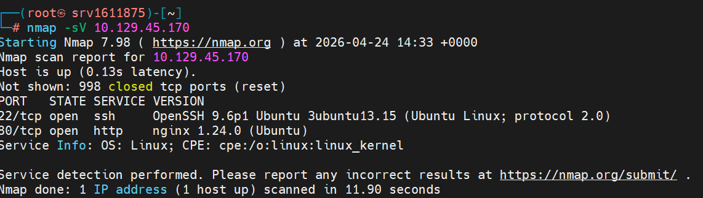

# Silentium

> **Dificuldade:** Easy | **SO:** Linux | **Release:** Active

---

## Informações Gerais

| Campo | Valor |
|:------|:------|
| **Nome** | Silentium |
| **IP** | 10.129.45.170 |
| **SO** | Linux |
| **Dificuldade** | Easy |
| **Data** | 24/04/2025 |
| **Release** | Active |
| **Status** | Em Andamento |

---

## Enumeração Inicial

### Portas Abertas

| Porta | Serviço | Versão |
|:------|:--------|:-------|
| 22 | ssh | OpenSSH |
| 80 | http | Nginx |

### Comandos

```bash
nmap -sV -p- -T4 10.129.45.170
```

---

## Exploração

### Vetor de Entrada

| Campo | Valor |
|:------|:------|
| **Vetor** | Web |
| **Falha** | Password Reset Token Leak + Flowise RCE |
| **Ferramentas** | Burp Suite, FFUF |

### Passo 1 - Enumeração de portas e serviços

Enumerando portas e serviços que estão rodando no alvo.



---

### Passo 2 - Accessando silentium.htb

Acessando o HTTP do alvo, reconhecemos um domínio **silentium.htb**.

Encontrei nomes de colaboradores na página:
- Marcus Thorne (Managing Director)
- Ben (Head of Financial Systems)
- Elena Rossi (Chief Risk Officer)


---

### Passo 3 - Descoberta de subdomínio

Fazendo um fuzzing com o domínio encontrado, foi descoberto o subdomínio **staging.silentium.htb**.


---

### Passo 4 - Página de login

Acessando o subdomínio via web, conseguimos entender que se trata de uma página de login, mas não temos credenciais.

A página está usando **Flowise**.


---

### Passo 5 - Password Reset

Como temos o nome dos colaboradores na página inicial de silentium.htb, tentei utilizar o email **ben@silentium.htb**, por ser o único com o nome simples sem sobrenome.

Por surpresa, tive a resposta de um token temporário para fazer a troca de senha!


---

### Passo 6 - Alterando senha do admin

Depois de algumas tentativas de mudar a senha, consegui fazer a alteração com o token temporário (tem que fazer rápido para não expirar).

Consegui alterar a senha para **Password@123**

A chave de criptografia encontrada: **hdsVqdkOcLN4fwdpvMPtbAi2++qi8yFc**


---

### Passo 7 - Acesso ao painel admin

Depois de ter as credenciais, acessei o painel administrativo.


---

### Passo 8 - Identificando Flowise

Ao acessar o painel admin, identifiquei que está utilizando a ferramenta **Flowise**.

Com essa informação, decidi buscar por CVEs relacionadas à ferramenta. Encontrei dois exploits.


---

### Passo 9 - Pesquisando exploits

Buscando sobre os exploits, vi que o **JS Injection** permite uma execução remota de código, utilizando um package chamado CustomMCP.ts.

Se as variáveis de ambiente FLOWISE_USERNAME e FLOWISE_PASSWORD não estiverem configuradas, apenas o email e senha para acesso ao Flowise são necessários.


---

### Passo 10 - Executando exploit RCE

Usando o exploit e setando os parâmetros necessários para a conexão, conseguimos abrir um reverse shell com o servidor.


---

### Passo 11 - Acesso SSH como Ben

Com acesso ao shell, após várias tentativas procurando manualmente nas pastas, fiz um cat buscando as variáveis de ambiente.

Decidi utilizar a credencial de SMTP como acesso ao SSH, onde consegui acessar o shell com o usuário **ben**.


---

### Passo 12 - Captura da User Flag

Acessei o sistema como ben e capturei a primeira flag.

**User Flag:** `a89d6d7f3b1c4e9a2d5c8b7f4e6a1c3d`


---

## Shell Inicial

```bash
ssh ben@10.129.45.170
# senha: hdsVqdkOcLN4fwdpvMPtbAi2++qi8yFc
python3 -c "import pty; pty.spawn('/bin/bash')"
```

---

## Enumeração Pós-Exploração

### Credenciais Encontradas

| Tipo | Valor |
|:-----|:------|
| Admin Panel | admin:Password@123 |
| SSH | ben:hdsVqdkOcLN4fwdpvMPtbAi2++qi8yFc |

---

## Escalação de Privilégios

### Passo 13 - Procurando vetores de escalação

Começando a busca por possíveis vetores de escalonamento de privilégios.

Alguns comandos não funcionaram, então busquei por binários que temos permissão de execução como root.


---

## Flags

| User | Root |
|:-----------------------------|:---------------------|
| `a89d6d7f3b1c4e9a2d5c8b7f4e6a1c3d` | Em Andamento |

---

## Resumo Técnico

| Campo | Valor |
|:------|:------|
| **Causa Raiz** | Password reset token leak + Flowise RCE |
| **Cadeia de Ataque** | Subdomain enum → Password reset → Admin access → Flowise RCE → SSH → Privesc |
| **Tempo Total** | ~45 minutos |

---

## Lições Aprendidas

- **O que funcionou:** Enumeração de subdomínios + password reset attack
- **O que atrasou:** Entender como explorar o Flowise
- **Pontos de Atenção:** Sempre verificar vulnerabilidades de reset de senha

---

## Referências

- [HTB Silentium](https://app.hackthebox.com/machines/Silentium)